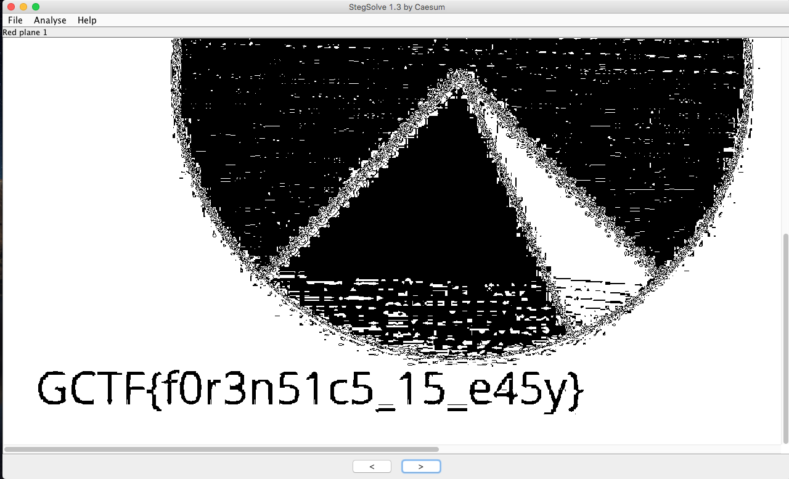

# CAFE BABE IS BABE
Forensics - 25 points

## Challenge 
> HELP!!I NEED THIS FILE FOR MY ASSIGNMENT BUT I CANT OPEN IT
> Creator - @paux

[IMPORTANTPIECHART_7d3b45a1f122c71f24fddb1ac3750113.jpg](IMPORTANTPIECHART_7d3b45a1f122c71f24fddb1ac3750113.jpg)

## Solution
Examining the file, the JPEG header is overriden with CAFE BABE.

[I referred to this simple tutorial](https://samsclass.info/121/proj/p7-image-header.htm) on fixing JPEG headers. 

	cp IMPORTANTPIECHART_7d3b45a1f122c71f24fddb1ac3750113.jpg fixed.jpg
	printf '\xff\xd8\xff\xe0\x00\x10' | dd conv=notrunc of=fixed.jpg bs=1 seek=0

Now, the image is viewable!
But there's no flag yet.

Open the image in StegSolve and when we go to Red Plane 1 we see this

## Flag
`GCTF{f0r3n51c5_15_e45y}` 