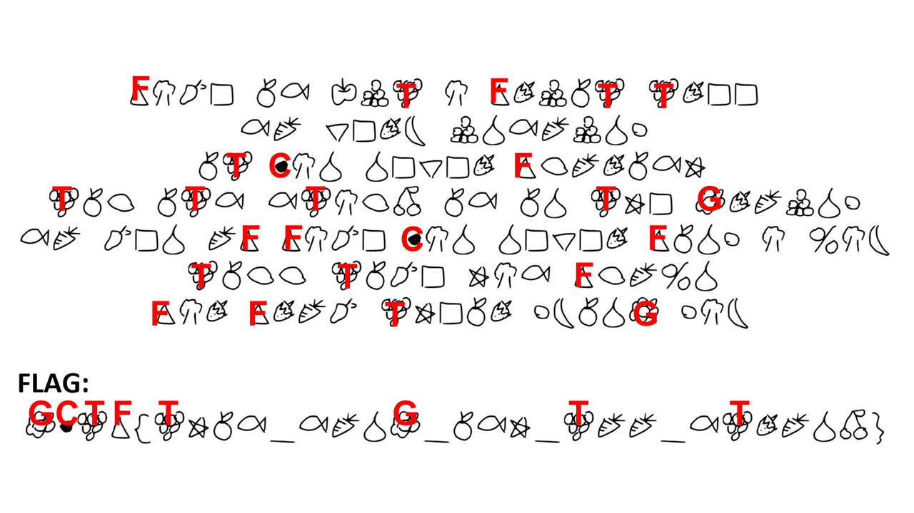
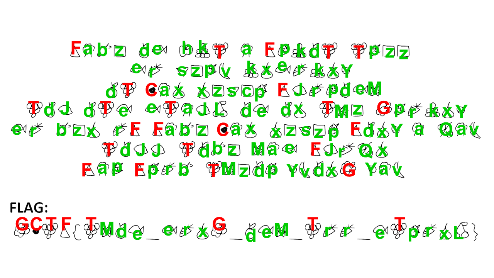
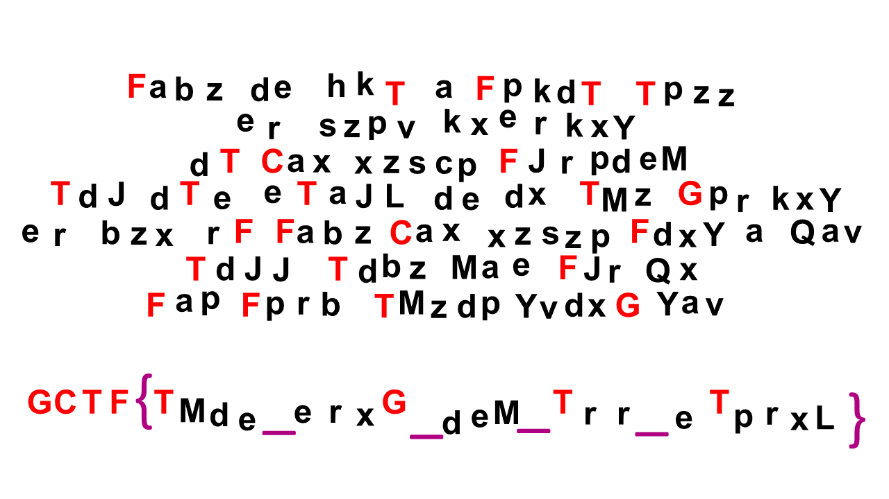

# FruitTree
Crypto - 25 points

## Challenge 
> Hi! Ive created a new language! translate it and get the flag!!

> (flag is in GCTF{} format with all characters within being in caps)

> Created by @paux

> [FruitTree_25ca2c869b916f56ab70e224f2413ccd.JPG](FruitTree_25ca2c869b916f56ab70e224f2413ccd.JPG)

## Solution

This seems to be drawings representing the English alphabet. It can be solved like a substitution cipher.

First, since we know the flag is in the format `GCTF{...}` we can fill that in.

Next, I took the painful and time-consuming process of converting each symbol into an alphabetical version

This leaves me with the following

	FABZ DE HKT A FPKDT TPZZ
	ER SZPV KXE KXERKXY
	DT CAX XZSCP FJRPDEM
	TDJDTE ETAJL DE DX TMZ GPRKXY
	ER BZX RF FABZ CAX XZSZP FDXY A QAV
	FAP FPRB TMZDP YVDXG YAV

	GCTF{TMDE_ERXG_DEM_TRR_ETPRXL}

Finally, use a [substitution solver](https://www.guballa.de/substitution-solver)

	FAME IS BUT A FRUIT TREE
	SO VERY UNS UNSOUND
	IT CAN NEVCR FLORISH
	TILITS STALK IS IN THE GROUND
	SO MEN OF FAME CAN NEVER FIND A WAY
	FAR FROM THEIR DYING DAY

	GCTF{THIS_SONG_ISH_TOO_STRONK}

## Flag
`GCTF{THIS_SONG_ISH_TOO_STRONK}`
