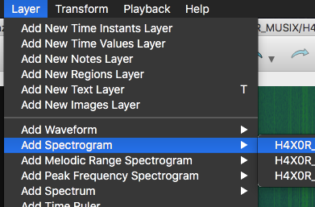
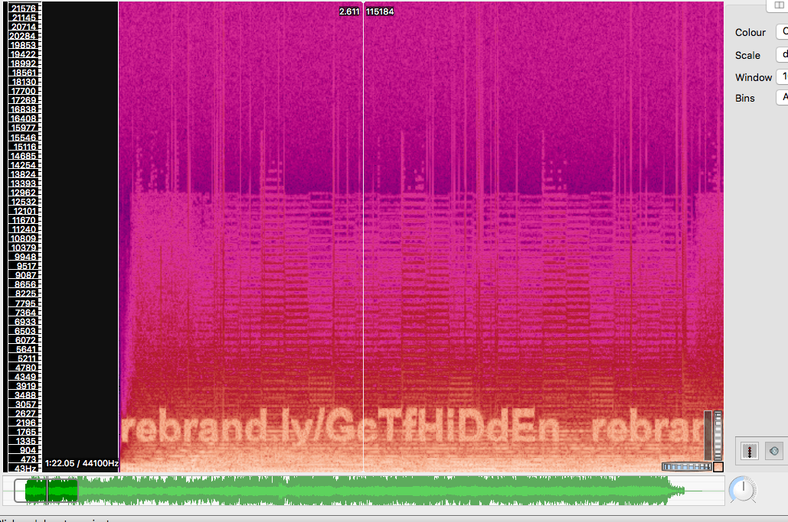

# HAXOR_MUSIX
Forensics - 35 points

## Challenge 
> CTFs are fun! heres music for you to hack to!!

>Creator - @paux

[H4X0R_MUZIK_c2c3d77deb5d41fd471570fc6c97a85d.wav](H4X0R_MUZIK_c2c3d77deb5d41fd471570fc6c97a85d.wav)

## Solution

This is similar to [PACTF 2017 Synesthesia](https://github.com/zst123/pactf-2017-writeups/tree/master/Round-2_Boole/Synesthesia).

We can analyse the music file in Sonic Visualizer.

`Layer` > `Add Spectrogram` > `All Channels`

---

Immediately, we can see something upon zooming in

[rebrand.ly/GcTfHiDdEn](rebrand.ly/GcTfHiDdEn) which redirects to [http://web.chal.gryphonctf.com:17651/index.txt](http://web.chal.gryphonctf.com:17651/index.txt).

Cached copy is here [`index.txt`](index.txt). We see some weird repetition of `Ook`s.

Search for `Ook` leads us to an [esoteric language](http://www.dangermouse.net/esoteric/ook.html). As written on the page, it can be converted to the Brainfuck language. 

I've written a script to convert it to Brainfuck language according to [the documentations](http://www.dangermouse.net/esoteric/ook.html). I'll also be using this [Brainfuck language interpreter](https://github.com/pocmo/Python-Brainfuck) I've grown to love.

	$ python3 convert.py > flag.bf
	$ git clone https://github.com/pocmo/Python-Brainfuck
	$ cd Python-Brainfuck/
	$ python brainfuck.py ../flag.bf
	GCTF{much_mu51x_much_h4x0r}

## Flag
`GCTF{much_mu51x_much_h4x0r}`