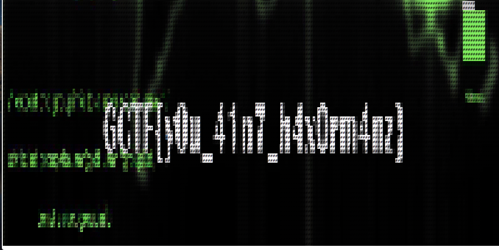

# Haxor wallpaper
Misc - 20 points

## Challenge 
> This cringey script kiddie from YouTube constantly claims that he's an elite hacker. He sent me this file claiming that it's the source code for a wallpaper virus that he had written. I'm really scared to run it. Help me figure out what he sent!

> Creator's note: This isn't a virus...

> Creator - @Platy

[hacker_21d994494f213d7d8222615009b65abd.txt](hacker_21d994494f213d7d8222615009b65abd.txt)

## Hint
> Roses are red, violets are blue,
> HTML is not a programming language, I'm terrible at rhymes sorry.

## Solution
Opening the HTML file in a browser, we see different colours of `#`.

I can barely make out the flag. The contrast is poor. The easiest solution is to make the background of the character reflect the colour

	$ cat hacker_21d994494f213d7d8222615009b65abd.txt | sed 's/color/background-color/g' > flag.html
	$ open -a "Google Chrome" flag.txt

Open flag.html and we see a nice pixel art

## Flag
`GCTF{y0u_41n7_h4x0rm4nz}`