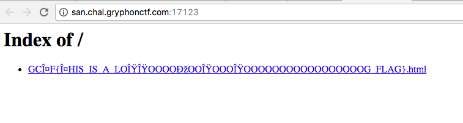
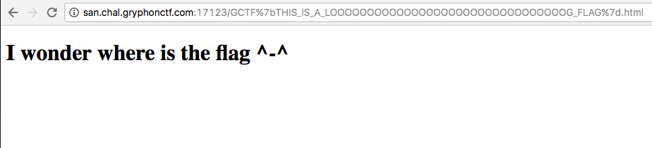

# Same Same But Different
Sanity - 5 points

## Challenge 
> Flag is at http://san.chal.gryphonctf.com:17123
> Have fun!
> https://youtu.be/nREK2Wj0wJ4?t=25s
> 
> Creator - @kkkkk & @exetr

## Solution
Go to the page and we see this 

Upon clicking it we see this.

The URL looks suspicious:
`GCΤF%7bΤHIS_IS_A_LOΟΟOOOOОOOΟOOOΟOOOOOOOOOOOOOOOOOG_FLAG%7d`

HTML decode it and we get this:
`GCΤF{ΤHIS_IS_A_LOΟΟOOOOОOOΟOOOΟOOOOOOOOOOOOOOOOOG_FLAG}`

Submit the flag but is not successful!

Looking at the first screenshot, the flag seems to be in unicode. Maybe there's some letters that are lookalikes.
I'll retype it using my keyboard in ASCII

`GCTF{THIS_IS_A_LOOOOOOOOOOOOOOOOOOOOOOOOOOOOOOOOG_FLAG}`

## Flag
`GCTF{THIS_IS_A_LOOOOOOOOOOOOOOOOOOOOOOOOOOOOOOOOG_FLAG}`
