# The Mooncake Box
Misc - 50 points

## Challenge 
> It is said that steganography was first discovered within the intricate designs baked onto mooncakes. The Chinese made use of this technique during the China-Mongolia war by using mooncakes as their inconspicuous medium of communication.Mid-Autumn arrives yet again, and you can't help to notice a sleek, dark mooncake box lying on the dining table. The design puzzles you. Is that a QR code? Are those binary digits?? Are they trying to promote their mooncake brand, or am I just missing something?

> Recommended Reads
> - http://www.thonky.com/qr-code-tutorial/format-version-information
> - http://www.thonky.com/qr-code-tutorial/format-version-tables
> - http://www.qrcode.com/en/about/version.html
> - http://datagenetics.com/blog/november12013/index.htmlCreator 

> @Optixal

[mooncake_box_design_522cb125672e59e884a3d353efb8b6f6.png](mooncake_box_design_522cb125672e59e884a3d353efb8b6f6.png)

## Solution

(This is a really fun project on fixing garbled QR codes; it took me 3 fun hours doing pixel art.)

### Find clues

There's a few important clues on the mookcake box.

1. The 15 bit format string: `001110011100111`
2. There's 29 written on all 4 sides, meaning `29x29` pixels QR code
3. The picture also tells us to rotate anti-clockwise by `45 degrees`.

### Preparing

First, I'll enhance the QR code on the mooncake box as I'll be transferring it over pixel by pixel.

Crop and rotate anti-clockwise by 45 degrees, sharpen and invert the colours

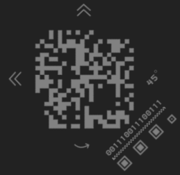
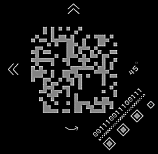

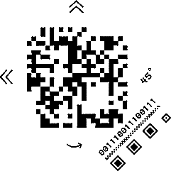

--- 
### Understand QR code

These are the things we need to fix...

#### 1. Size
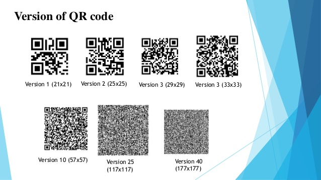

We are given 29 on the mooncake box.
We can conclude that it is the size of 29x29 because each QR code version has a specific size.

#### 2. Patterns
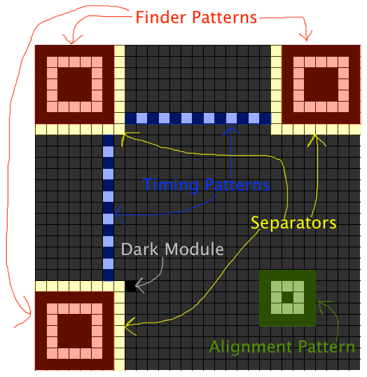
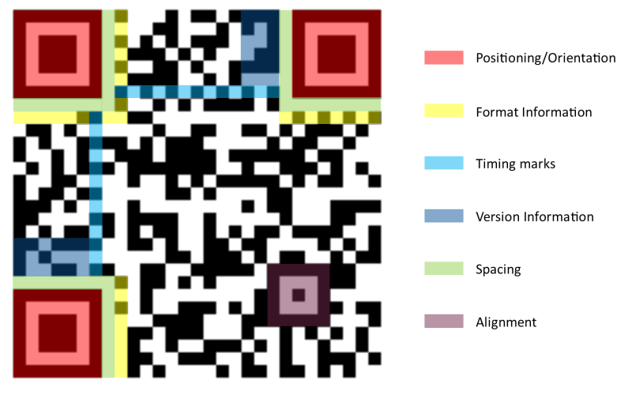

- **Position Patterns**: in the 3 corners (a 7x7 border with a 3x3 black square).
- **Timing Patterns**: strip of alternating pixels
- **Alignment Pattern**: in the bottom-right (5x5 border with 1x1 black square, and 4 pixels gap from bottom-right corner) 
- **Dark Module**: a pixel that's always black

#### 3. Format String Information
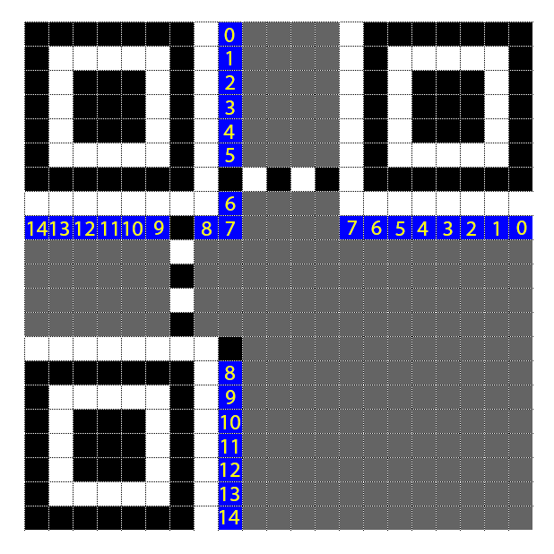

These are the locations where the format string must be placed.
The numbers are the bit position:

| 14 | 13 | 12 | 11 | 10 | 9  | 8  | 7  | 6  | 5  | 4  |  3 | 2  | 1  | 0  |
|----|----|----|----|----|----|----|----|----|----|----|----|----|----|----|
|   0|   0|   1|   1|   1|   0|   0|   1|   1|   1|   0|   0|   1|   1|   1|

---

### Process
I patched up the QR code in GIMP

#### Step 1: Position Patterns
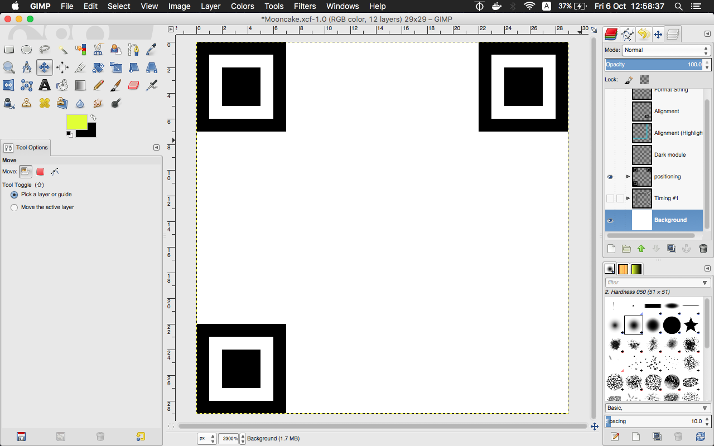

#### Step 2: Timing Patterns

#### Step 3: Dark Module
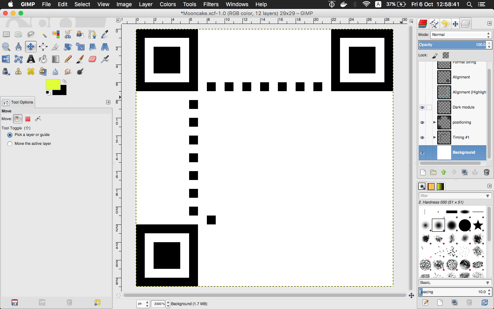

#### Step 4: Alignment Pattern
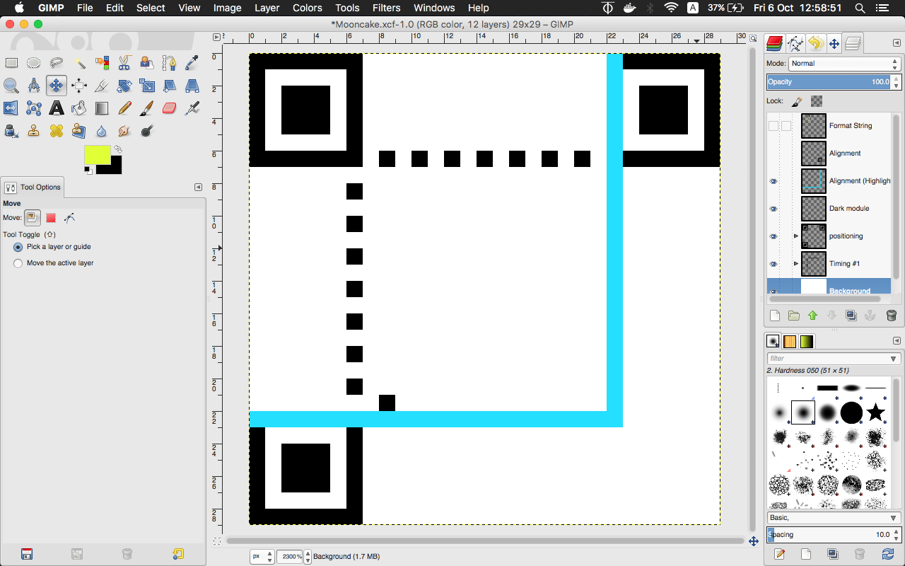
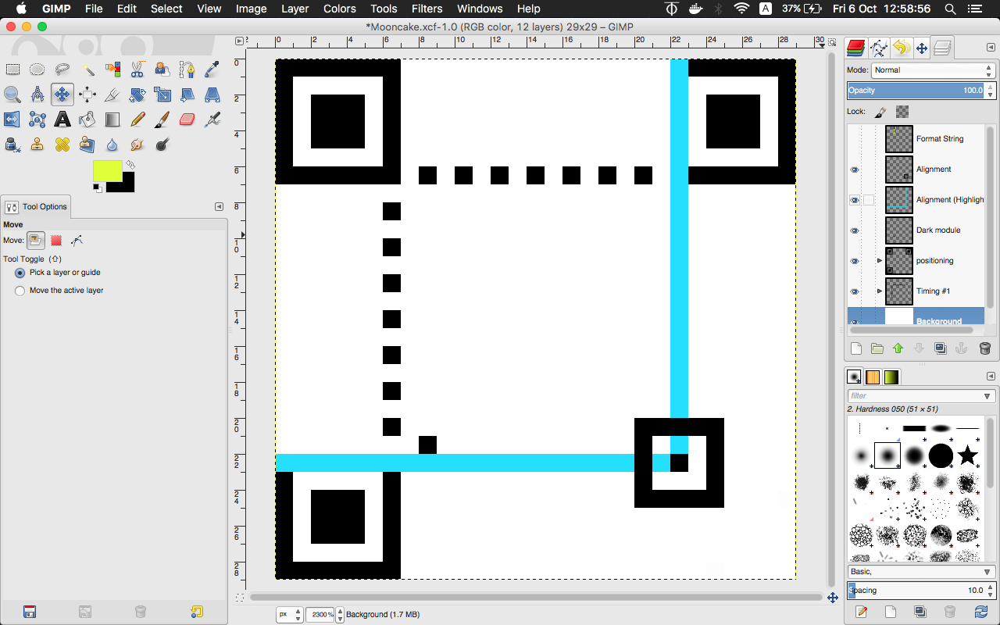
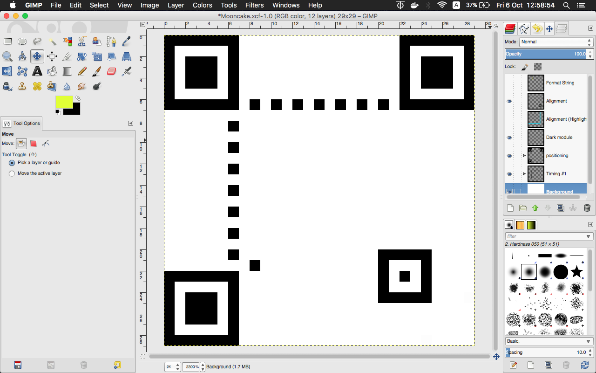

#### Step 5: Format String
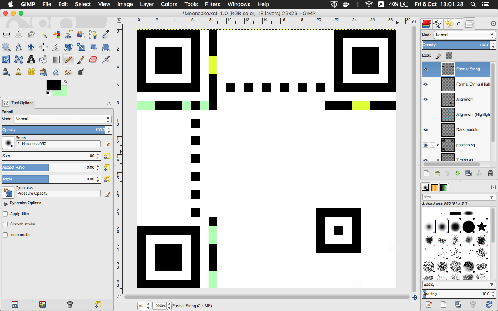

#### Step 6: Data Pixels (transferring over)
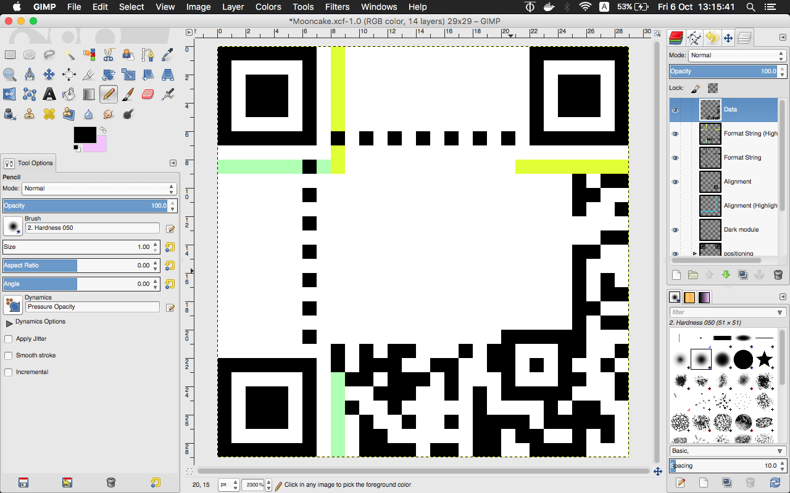
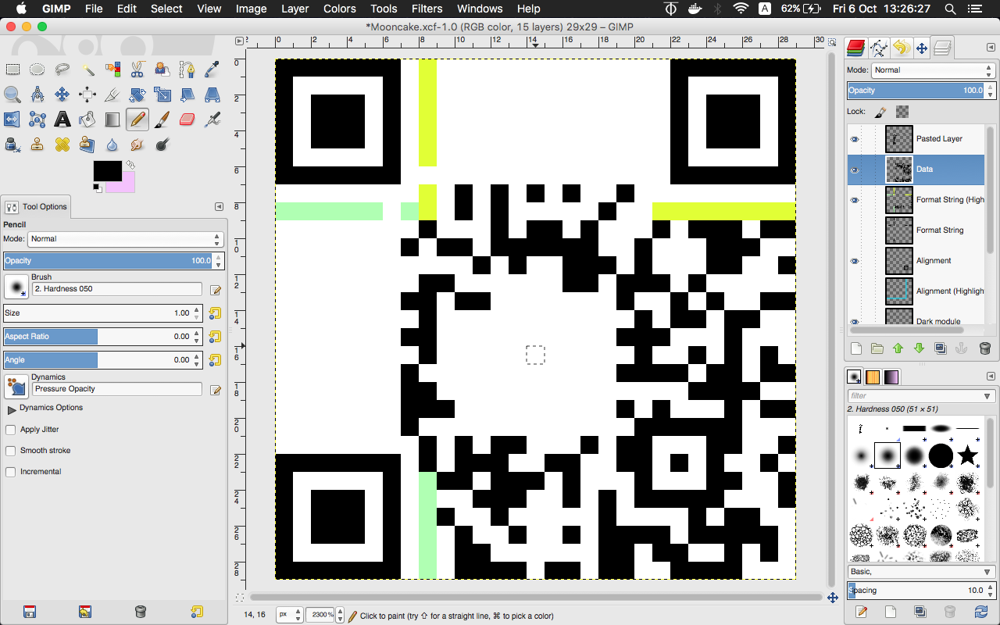
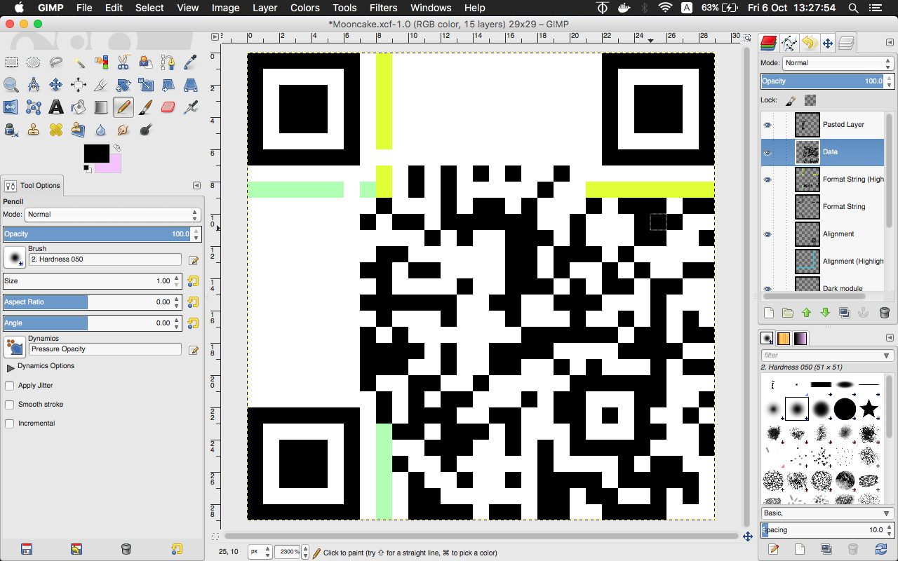

#### Done!
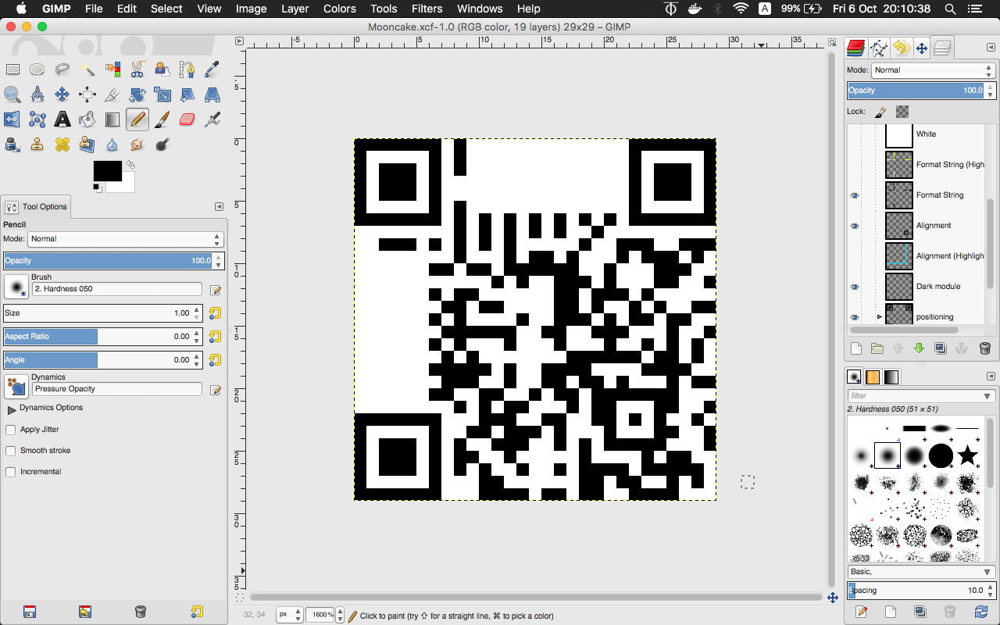

> FINAL FILE

>***[Mooncake.xcf](Mooncake.xcf)***

## Flag
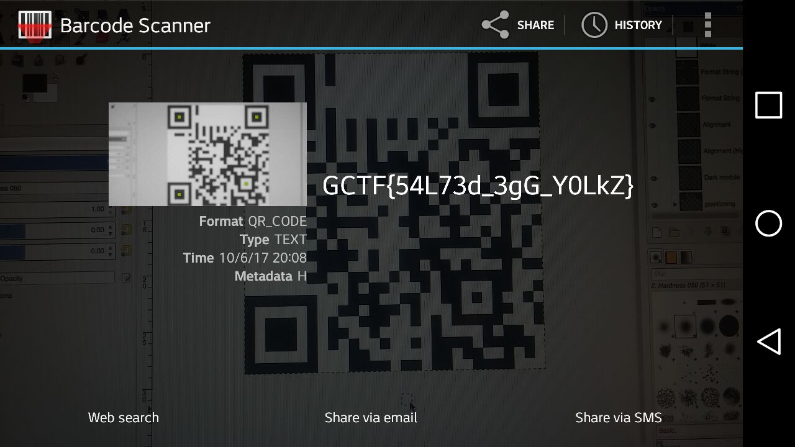

`GCTF{54L73d_3gG_Y0LkZ}`