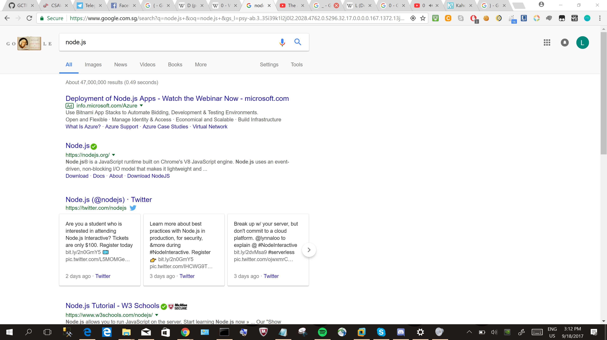

# Where_Is_It_Again
Forensics - 35 points

## Challenge 
> More suspicious network activity :(, they seem to be sending alot of data please help!

> Creator - @paux

[hidden_738511b6e734f8191310bec933102d12.pcap](hidden_738511b6e734f8191310bec933102d12.pcap)

## Solution
Look through the `.pcap`, we see the following text at frame 121: `Hey guy, im gon send soon hahah`

Interestingly enough, both the source IP and destination IP are the same, only the ports are different.

Using the wireshark filter:

	(ip.src == 192.168.242.128 && ip.dst == 192.168.242.128)

These are a few interesting packets:

- 121: `Hey guy, im gon send soon hahah` (42000 -> 39055)
- 209: `okok` (39055 -> 42000)
- 211: `here you go lol` (42000 -> 39055)
- 480: `thanks m8!` (39055 -> 42000)

After this, we see large data of 22084 bytes at frames 482 onwards. They appear to be fragments of base64-encoded file.
Find all the fragments sending from port 42000 -> 39055.

---

In Wireshark: 
- `File` > `Export Specified Packets`
- Set Range: `482, 484, 486-496, 508-524, 530, 531, 533`
- Save as `flag.pcap`

---

Extract the data:

	# extract hex encoded data from pcap
	$ tshark -r flag.pcap -T fields -e data.data > flag_hex.txt

	# remove colons from the hex data and decode it
	$ cat flag_hex.txt | sed 's/://g' > flag_hex2.txt

	# remove newlines and whitespaces then decode the hex
	$ cat flag_hex2.txt | python -c 'import sys; print sys.stdin.read().replace("\n", "").strip().decode("hex")' > b64.txt

	# base64-decode
	$ cat b64.txt | base64 --decode > flag

	# check what file it is 
	$ file flag 
	flag: JPEG image data, JFIF standard 1.01

	$ mv flag flag.png && open flag.png

We see a screenshot of Chrome web browser. Notice how the first letter of each tab is the flag `>.>`

## Flag
`GCTF{D0nT_L00K}`
